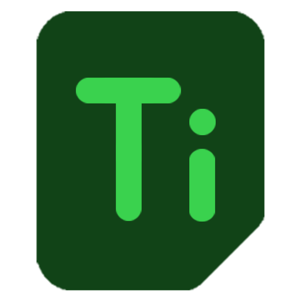

<!-- Logo -->

    

<!-- Title & description -->
<h1 align="center">[TinyProject]</h1>

Simple client-oriented project listing web app.

<!-- Badges -->

    

    

    

<!-- Est. read time -->
 
est. read time: <strong>< 1 minute</strong>
  

## About the project

This is a personal project of mine that embraces simple web app development built from scratch using popular front-end frameworks such as **react** and **tailwind**.

👉 [See live preview](https://daniel-c-j.github.io/tinyproject)

### Technical aspect

React concepts:

- Hooks (useState, useReducer, useEffect)
- Context
- Portal

General web tech concepts:

- Clean architecture
- Responsive design
- Light & dark theme
- Local storage
- Debouncing

## License

Distributed under terms of the [MIT License](./LICENSE).
